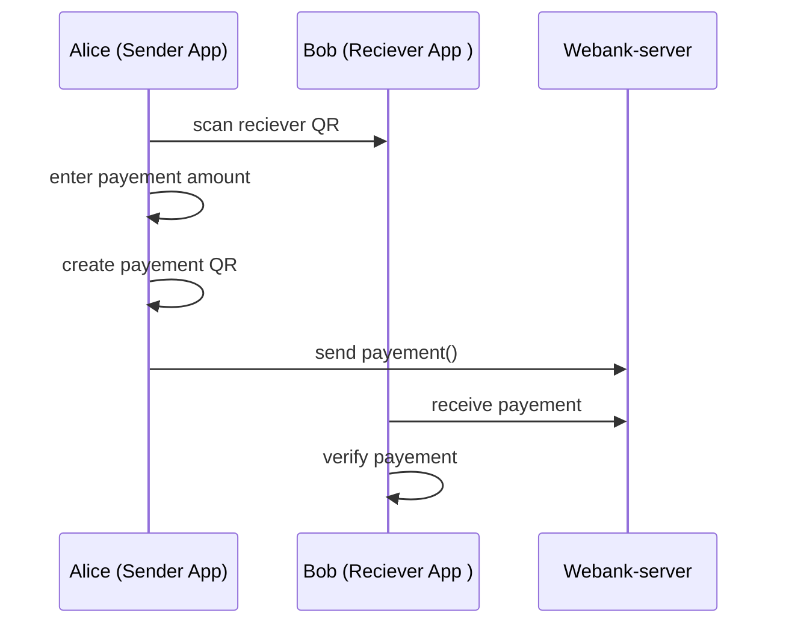
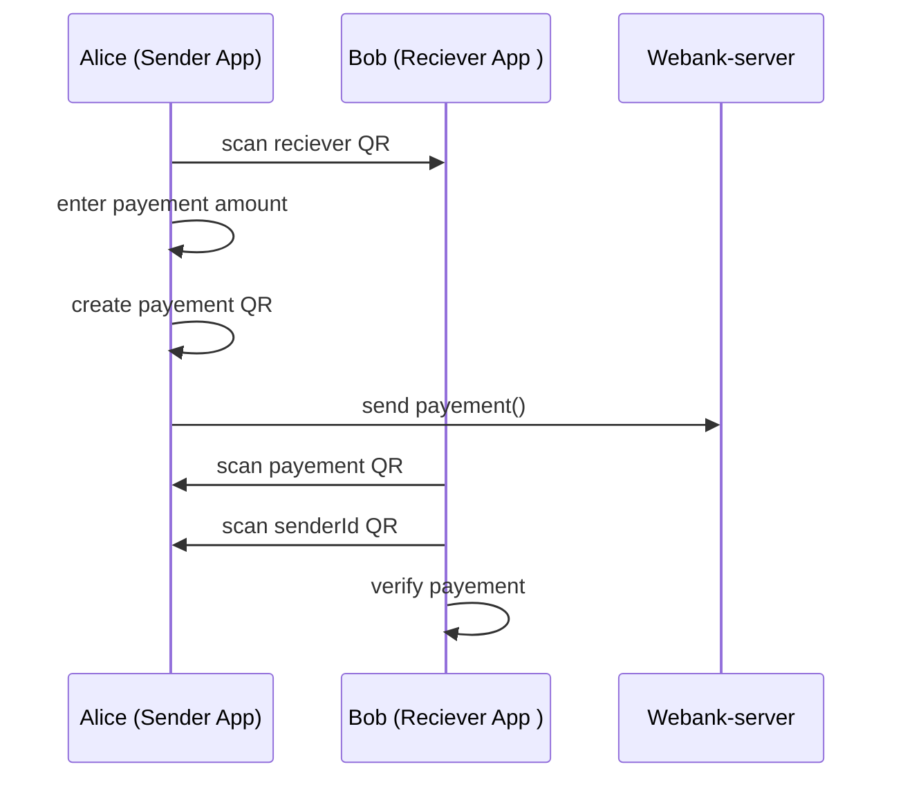
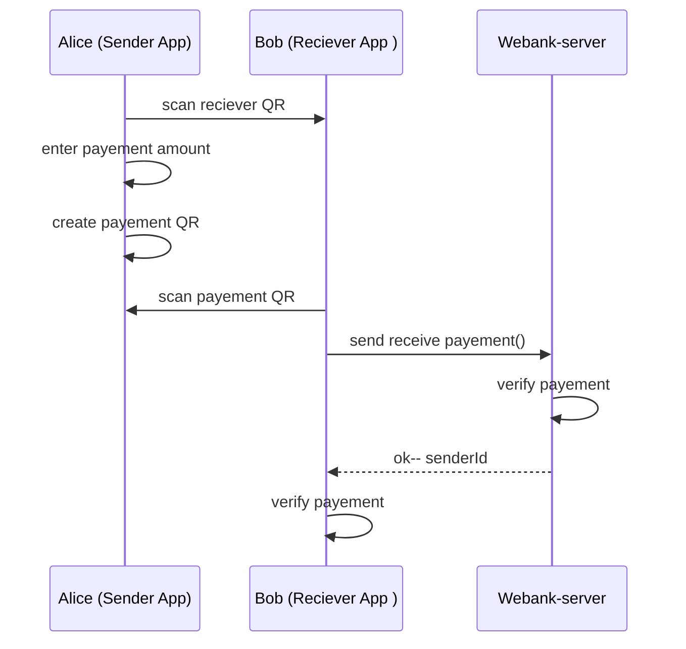
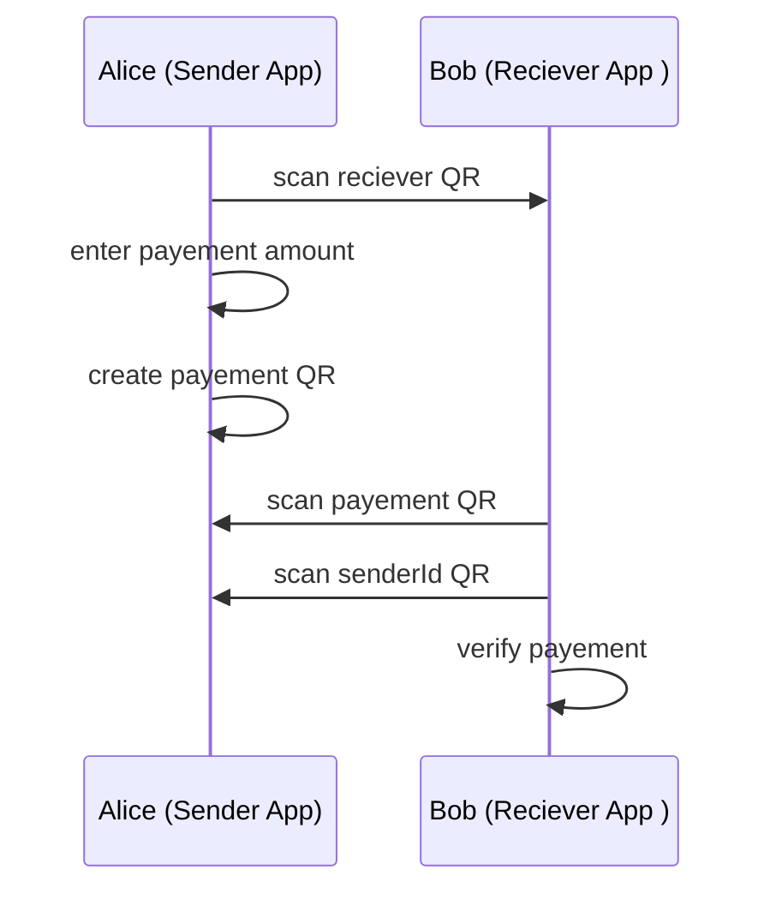

# Online - Online

```mermaid
sequenceDiagram
    participant SA as Alice (Sender App)
    participant RA as Bob (Reciever App )
    SA->>RA: scan reciever QR
    SA->>SA: enter payement amount
    SA->>SA: create payement QR
    participant Wb as Webank-server
    SA->>Wb: send payement()
    RA->>Wb: receive payement
    RA->>RA: verify payement
```

# Online - OFfline

```mermaid
sequenceDiagram
    participant SA as Alice (Sender App)
    participant RA as Bob (Reciever App )
    SA->>RA: scan reciever QR
    SA->>SA: enter payement amount
    SA->>SA: create payement QR
    participant Wb as Webank-server
    SA->>Wb: send payement()
    RA->>SA: scan payement QR
    RA->>SA: scan senderId QR
    RA->>RA: verify payement
```

# Offline - Online

```mermaid
sequenceDiagram
    participant SA as Alice (Sender App)
    participant RA as Bob (Reciever App )
    SA->>RA: scan reciever QR
    SA->>SA: enter payement amount
    SA->>SA: create payement QR
    RA->>SA: scan payement QR
    participant Wb as Webank-server
    RA->>Wb: send receive payement()
    Wb->>Wb: verify payement
    Wb-->>RA: ok-- senderId
    RA->>RA: verify payement
```

# Offline - Offline

```mermaid
sequenceDiagram
    participant SA as Alice (Sender App)
    participant RA as Bob (Reciever App )
    SA->>RA: scan reciever QR
    SA->>SA: enter payement amount
    SA->>SA: create payement QR
    RA->>SA: scan payement QR
    RA->>SA: scan senderId QR
    RA->>RA: verify payement
```